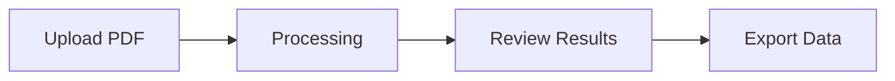

# Credit Card Processor 💳

A secure, enterprise-grade web application for processing and analyzing PDF credit card statements with intelligent data extraction and comprehensive reporting.

## 🎯 What It Does

The Credit Card Processor is a full-stack web application that helps you:

- **📄 Upload PDF Statements**: Securely upload credit card and bank statements (up to 100MB)
- **🤖 Extract Data Automatically**: Intelligent extraction of transactions, amounts, dates, and merchant information
- **📊 Analyze Results**: View extracted data with validation, categorization, and quality scoring
- **📁 Export Data**: Download results in CSV, Excel, or JSON formats for further analysis
- **🔐 Secure Processing**: Enterprise-grade security with audit logging and role-based access

### Key Benefits
- **Save Time**: Automate manual data entry from PDF statements
- **Improve Accuracy**: Intelligent extraction with validation and error detection
- **Enterprise Ready**: Production-grade security, monitoring, and scalability
- **User Friendly**: Intuitive web interface with real-time progress tracking

## 🚀 Quick Start (5 Minutes)

### Prerequisites
- Docker and Docker Compose installed ([Get Docker](https://docs.docker.com/get-docker/))
- 4GB+ RAM and 10GB+ disk space

### 1. Get the Code
```bash
git clone https://github.com/your-org/credit-card-processor.git
cd credit-card-processor
```

### 2. Start the Application
```bash
# Start all services (takes 2-3 minutes first time)
docker-compose up -d

# Check everything is running
docker-compose ps
```

### 3. Access the Application
- **Web Interface**: http://localhost:3000
- **API Documentation**: http://localhost:8001/docs

### 4. Upload Your First File
1. Open http://localhost:3000 in your browser
2. Drag and drop a PDF credit card statement
3. Click "Upload" and wait for processing to complete
4. View the extracted transaction data
5. Export results in your preferred format

**That's it!** 🎉 You're now processing PDF statements automatically.

## 📖 How to Use

### Basic Workflow



### 1. Upload Files
- **Supported**: PDF files only (credit card statements, bank statements)
- **Size Limit**: 100 bytes to 100MB
- **Security**: Files are validated and processed in isolation
- **Progress**: Real-time upload and processing indicators

### 2. Monitor Processing
- **Automatic**: Processing starts immediately after upload
- **Status Updates**: Real-time progress with detailed stages
- **Quality Score**: Data extraction quality assessment (0-100%)
- **Error Handling**: Clear error messages with resolution guidance

### 3. Review Results
- **Transaction List**: All extracted transactions with details
- **Data Validation**: Flagged issues and confidence scores  
- **Filtering**: Sort and filter by date, amount, merchant, category
- **Quality Report**: Summary of extraction accuracy

### 4. Export Data
- **CSV**: Comma-separated values for Excel/analysis tools
- **Excel**: Native .xlsx format with formatting
- **JSON**: Structured data for developers/APIs

### User Roles
- **Regular Users**: Upload files, view their own results, export data
- **Admin Users**: All user functions plus system monitoring and user management

## 🏭 How to Deploy

### Development Deployment (Local Testing)
```bash
# Clone and start
git clone https://github.com/your-org/credit-card-processor.git
cd credit-card-processor
docker-compose up -d

# Access at http://localhost:3000
```

### Production Deployment (Enterprise)

#### Option 1: Automated Production Setup
```bash
# 1. Generate SSL certificates
./scripts/generate-ssl-dev.sh

# 2. Configure production environment
cp .env.production.template .env.production
# Edit .env.production with your production values

# 3. Deploy with automated script
./scripts/deploy-production.sh

# 4. Verify deployment
curl -k https://localhost/health
```

#### Option 2: Manual Production Setup
```bash
# 1. Configure environment variables
cp .env.production.template .env.production

# Edit critical settings:
# - SESSION_SECRET_KEY: 32+ character random string
# - ADMIN_USERS: comma-separated admin usernames  
# - CORS_ORIGINS: your domain (https://yourdomain.com)
# - TRUSTED_HOSTS: your domain
# - SMTP settings for email alerts

# 2. Set up SSL certificates (production)
# For Let's Encrypt:
sudo certbot --nginx -d yourdomain.com
sudo cp /etc/letsencrypt/live/yourdomain.com/fullchain.pem nginx/ssl/cert.pem
sudo cp /etc/letsencrypt/live/yourdomain.com/privkey.pem nginx/ssl/key.pem

# 3. Deploy production stack
docker-compose -f docker-compose.prod.yml up -d

# 4. Optional: Add monitoring
docker-compose -f docker-compose.prod.yml -f docker-compose.monitoring.yml up -d
```

### Production Checklist
- [ ] Environment variables configured
- [ ] SSL certificates installed and valid
- [ ] Database backup procedures configured
- [ ] Email alerts configured and tested
- [ ] Firewall rules configured (ports 80, 443)
- [ ] Monitoring dashboards accessible
- [ ] Performance testing completed
- [ ] User acceptance testing passed

### Deployment Verification
```bash
# Health check
curl https://yourdomain.com/health

# API documentation
open https://yourdomain.com:8001/docs

# Monitoring (if enabled)
open https://yourdomain.com:3001  # Grafana
```

### Scaling for High Volume
```bash
# Increase backend workers
echo "BACKEND_WORKERS=4" >> .env.production

# Add resource limits
echo "BACKEND_MEMORY_LIMIT=1G" >> .env.production
echo "BACKEND_CPU_LIMIT=2.0" >> .env.production

# Restart with changes
docker-compose -f docker-compose.prod.yml up -d
```

## ❓ User Questions & Answers

### Getting Started

**Q: What file formats are supported?**
A: Currently, only PDF files are supported. We specifically support credit card statements, bank statements, and similar financial documents. Support for Excel and CSV files is planned for v1.1.

**Q: What's the maximum file size I can upload?**
A: The maximum file size is 100MB. Most credit card statements are 1-5MB, so this limit accommodates even very large statements with many pages.

**Q: How long does processing take?**
A: Processing time depends on file size and complexity:
- Small files (< 1MB): 10-30 seconds
- Medium files (1-10MB): 30-60 seconds  
- Large files (10-100MB): 1-3 minutes

**Q: Is my data secure?**
A: Yes! Security features include:
- All data encrypted in transit (HTTPS/TLS 1.2+)
- Files processed in isolated containers
- No data shared between users
- Complete audit logging
- Automatic file cleanup after processing
- Role-based access controls

### Using the Application

**Q: Can I upload multiple files at once?**
A: Yes! You can select and upload multiple PDF files simultaneously. Each file is processed independently and you can monitor progress for each one individually.

**Q: What if my file fails to process?**
A: The system provides detailed error messages:
- **Invalid format**: "Please upload a PDF file"
- **File too large**: "File exceeds 100MB limit"
- **Corrupted file**: "File appears to be corrupted, please try again"
- **Processing error**: Detailed explanation with suggested solutions

**Q: How accurate is the data extraction?**
A: Accuracy varies by statement format:
- **Standard formats**: 95%+ accuracy
- **Complex layouts**: 85-95% accuracy
- **Scanned documents**: 75-90% accuracy
- Each result includes a quality score and confidence indicators

**Q: Can I edit the extracted data?**
A: The current version doesn't support editing extracted data. However, you can:
- Review all extractions before export
- See confidence scores for each field
- Flag questionable data for manual review
- Export raw data for editing in Excel

**Q: What export formats are available?**
A: Three export formats are supported:
- **CSV**: Best for Excel and data analysis tools
- **Excel (.xlsx)**: Native Excel format with formatting
- **JSON**: Structured data for developers and APIs

### Technical Questions

**Q: Can I access this remotely?**
A: Yes! For production deployment:
1. Deploy on a server with a public IP
2. Configure SSL certificates for your domain
3. Set up proper firewall rules
4. Users can access via https://yourdomain.com

**Q: How many users can use it simultaneously?**
A: The system supports:
- **Development**: 5-10 concurrent users
- **Production**: 20+ concurrent users
- **High-scale**: Can be scaled horizontally for more users

**Q: Is there an API I can use?**
A: Yes! A complete REST API is available:
- **Interactive docs**: Visit /docs endpoint
- **Authentication**: Header-based authentication
- **All functions**: Upload, process, retrieve results, export
- **Rate limiting**: Configurable limits to prevent abuse

**Q: Can I integrate this with other systems?**
A: Absolutely! Integration options:
- **REST API**: Complete programmatic access
- **Webhooks**: Notifications when processing completes
- **Export APIs**: Automated data retrieval
- **Monitoring APIs**: System health and metrics

### Administration & Management

**Q: How do I add new users?**
A: User management depends on your authentication method:
- **Windows Auth**: Users are automatically recognized from Windows domain
- **Header Auth**: Configure your reverse proxy to set user headers
- **Admin Users**: Set via ADMIN_USERS environment variable

**Q: How do I monitor system health?**
A: Multiple monitoring options:
- **Basic health**: Visit /health endpoint
- **Detailed health**: /api/health/detailed endpoint
- **Grafana dashboards**: Full monitoring stack (optional)
- **Email alerts**: Automatic notifications for issues

**Q: Where are files stored and how long?**
A: File storage and retention:
- **Location**: Local filesystem in Docker volumes
- **Security**: Encrypted and access-controlled
- **Retention**: Files automatically cleaned up after processing
- **Backup**: Production backups configurable

**Q: How do I backup the system?**
A: Backup procedures:
- **Database**: Automated SQLite backups
- **Configuration**: Docker compose files and environment configs
- **Logs**: Configurable log retention and archival
- **Full system**: Docker volume snapshots

### Troubleshooting

**Q: The application won't start - what should I check?**
A: Common startup issues:
```bash
# Check service status
docker-compose ps

# Check logs for errors
docker-compose logs -f

# Verify ports aren't in use
netstat -tlnp | grep :3000
netstat -tlnp | grep :8001

# Check disk space
df -h

# Restart services
docker-compose restart
```

**Q: Upload is failing - what's wrong?**
A: Upload troubleshooting steps:
1. **File format**: Ensure it's a PDF file
2. **File size**: Check it's under 100MB
3. **Disk space**: Ensure server has adequate space
4. **Network**: Check for network connectivity issues
5. **Browser**: Try a different browser or clear cache

**Q: Processing seems stuck - what should I do?**
A: Processing troubleshooting:
1. **Wait**: Large files can take several minutes
2. **Check logs**: `docker-compose logs backend`
3. **System resources**: Monitor CPU/memory usage
4. **Restart**: `docker-compose restart backend`
5. **Re-upload**: Try uploading the file again

**Q: I can't access the admin features - why?**
A: Admin access troubleshooting:
1. **User configuration**: Check ADMIN_USERS environment variable
2. **Authentication**: Verify you're logged in correctly
3. **Headers**: Check authentication headers are set properly
4. **Restart**: Restart services after configuration changes

**Q: Performance is slow - how can I improve it?**
A: Performance optimization:
1. **Resources**: Increase Docker memory/CPU limits
2. **Concurrent processing**: Reduce simultaneous uploads
3. **System monitoring**: Check system resource usage
4. **Network**: Ensure good network connectivity
5. **Scaling**: Add more backend workers in production

### Advanced Usage

**Q: Can I customize the data extraction?**
A: Currently, extraction rules are built-in, but you can:
- Configure validation rules via API
- Set processing options (extract_transactions, validate_amounts)
- Filter results after processing
- Custom integration via API for post-processing

**Q: How do I set up monitoring and alerts?**
A: Full monitoring stack setup:
```bash
# Deploy with monitoring
docker-compose -f docker-compose.prod.yml -f docker-compose.monitoring.yml up -d

# Configure email alerts in .env.production:
SMTP_HOST=smtp.gmail.com
SMTP_USER=alerts@yourcompany.com
SMTP_PASSWORD=your-app-password
ALERT_EMAIL=admin@yourcompany.com

# Access monitoring:
# Grafana: http://localhost:3001
# Prometheus: http://localhost:9090
# AlertManager: http://localhost:9093
```

**Q: Can I run performance tests?**
A: Yes! Built-in performance testing:
```bash
# Run all performance tests
./scripts/performance-test.sh all-tests

# Run specific test types
./scripts/performance-test.sh load-test baseline
./scripts/performance-test.sh load-test stress

# Run benchmark suite
./scripts/performance-test.sh benchmark
```

**Q: How do I contribute or customize the code?**
A: Development and customization:
1. **Fork** the repository
2. **Local development**: `docker-compose up -d` 
3. **Code changes**: Follow the development guide in docs/
4. **Testing**: Run test suites before submitting changes
5. **Pull requests**: Submit via GitHub with description

**Q: Is there enterprise support available?**
A: Support options:
- **Community**: GitHub discussions and issues
- **Documentation**: Comprehensive docs in /docs folder
- **Professional services**: Contact for custom development and support
- **Training**: User and admin training available

---

## 📚 Additional Resources

- **📖 Complete Documentation**: [docs/README.md](docs/README.md)
- **🔌 API Reference**: [docs/api/API_REFERENCE.md](docs/api/API_REFERENCE.md)  
- **🚀 Deployment Guide**: [docs/production/DEPLOYMENT_GUIDE.md](docs/production/DEPLOYMENT_GUIDE.md)
- **📊 Monitoring Guide**: [docs/monitoring/MONITORING_GUIDE.md](docs/monitoring/MONITORING_GUIDE.md)
- **🧪 Testing Documentation**: [tests/acceptance/](tests/acceptance/)

## 🆘 Need Help?

- **💬 Community Support**: GitHub Discussions
- **🐛 Bug Reports**: GitHub Issues  
- **📧 Email Support**: support@yourcompany.com
- **📖 Documentation**: Check the docs/ folder first

---

**🎉 Ready to get started?** Run `docker-compose up -d` and visit http://localhost:3000

**Built with ❤️ for secure, intelligent document processing**